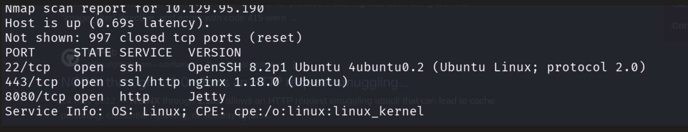
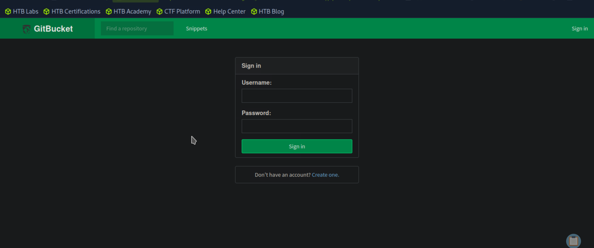
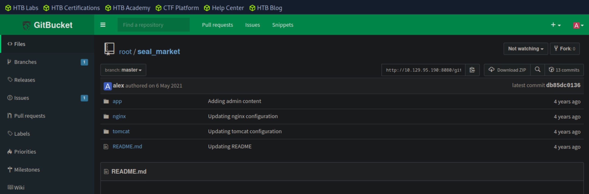

MACHINE SEAL WALKTHROUGH

Enumeration:

Nmap scan:

Nmap scan shows there are 3 ports open. Lets go and browse the ip given to see what we can found:

lets do a brute force attack with gobuster to see what we can find:

command: gobuster dir -u https://10.129.95.190 -w /usr/share/seclists/Discovery/Web-Content/common.txt

But the problem is that when we try accesing any of this directories we get a 403 forbidden error. lets go to the port 8080 to see if we can access that page.

there are to way to pass the login page. One is creating an account and the other one is using the default credentials that are root/root.

once we enter we see there is a repository called seal_market and we can see that there is where it lives the source code for the seal market page.

